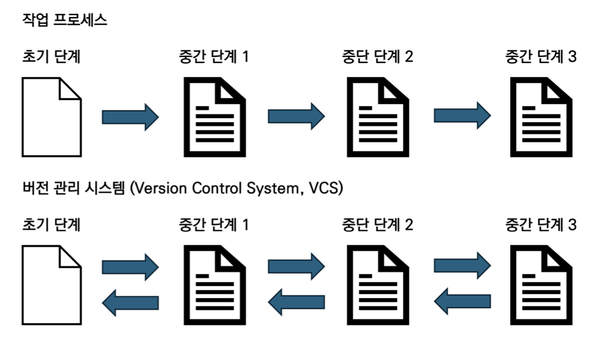
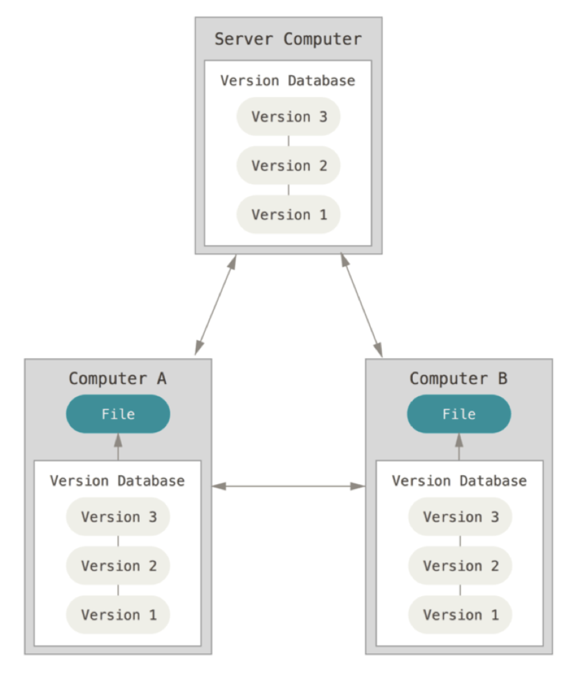
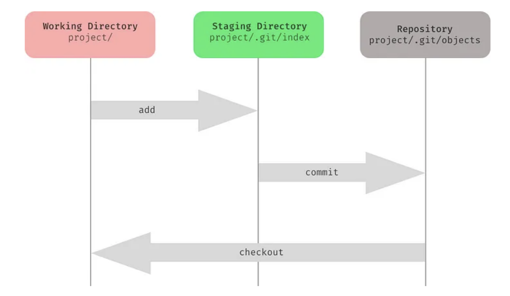
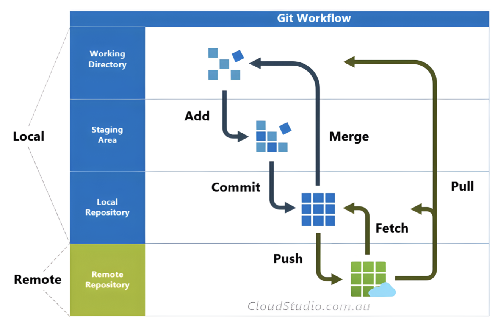
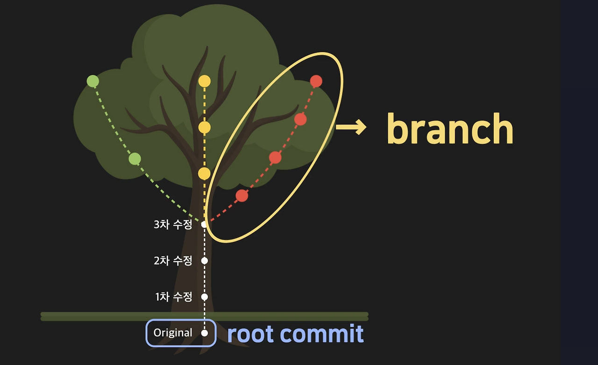

# 공부 자료

---

[교육 목표]

1. Git의 개념과 이해
2. Git의 핵심 구조 및 흐름
3. 브랜치
4. 협업 시 필요한 기본 명령어

---

## 1. Git이란?

> **Distributed Version Control System = 분산형 버전 관리 시스템**
> 

Git은 빠르고 효율적으로 파일 변경 이력을 관리하는 도구이자, 
여러 사람들이 동시에 안전하게 협업할 수 있게 해주는 무료 오픈소스 분산 버전 관리 시스템이다.

### 버전이란?

- 소프트웨어나 문서의 특정 시점 상태
- 버전을 기록함으로써 다양한 실험이나 기능 개발을 독립적으로 진행할 수 있음

### **버전 관리란?**

- 소스 코드나 문서 등의 변경 사항을 추적하고 기록하는 시스템
- 모든 변경 내역을 기록하여 파일의 현재 상태뿐만 아니라 과거의 상태도 관리가 가능하며, 쉽게 이전 상태로 되돌릴 수 있음
- 버전 관리를 통해 협업 과정에서 누가, 언제, 무엇을 수정했는지를 추적할 수 있음

**Git의 버전 관리 방식**

Git은 파일의 변경 사항을 기록하는 방식으로 스냅샷을 사용

- **스냅샷**이란?
    - 특정 시점의 파일 및 디렉토리 상태를 캡처한 것
- Git은 매 커밋마다 프로젝트 상태를 스냅샷처럼 저장한다.
- 스냅샷을 통해 프로젝트의 모든 변경 사항을 기록하고, 필요시 언제든지 해당 시점으로 돌아갈 수 있음

**버전 관리를 통해 얻고자 하는 것**



⇒ 파일의 변경 사항을 체계적으로 기록하고 관리하여 과거로 돌아가거나, 여러 사람의 작업을 병합하는 과정을 돕는 것

👉 한 줄 정리:

**파일의 변경 이력을 기록하고 필요할 때 이전 상태로 되돌릴 수 있게 관리하는 시스템**

### 분산 버전 관리 시스템이란?

`Distributed Version Control System = Distributed VCS`

- 각 개발자가 **전체 저장소(코드 + 변경 이력)를 로컬에 모두 복제**해서 작업하는 구조

→ 즉, 중앙 서버에만 기록이 있는 것이 아니라, 모든 팀원이 전체 프로젝트의 버전 기록을 가지고 있어 각자의 로컬에서 작업이 가능하다



이로써 장점:

- 서버에 문제가 생겨도 각자의 로컬 저장소에 버전이 보관되어 있으므로 복구 가능
- 인터넷이 없어도 로컬에서 커밋, 브랜치 등 대부분의 작업 가능
- 여러 사용자가 동시에 작업하고, 각자의 작업을 병합하는 과정이 유연함
- 협업이 필요할 때는 중앙 서버나 다른 사용자의 저장소와 동기화함

👉 한 줄 정리:

**모든 개발자가 동일한 저장소의 복사본을 가지고 독립적으로 작업하는 구조**

즉, 여러 개발자가 협업 시에 한 코드를 가지고 병렬적으로 진행할 수 있도록 해준다.

### GitHub란?

**Git 저장소를 올려두는 웹 서비스(플랫폼)**

- git 저장소를 원격 저장한다.
- 협업 기능을 제공한다. (PR, Issue, Code Review)
- CI/CD, Actions 등 자동화 기능 제공
- 웹에서 코드 확인 가능

→ "Git으로 관리한 코드를 인터넷에 올려서 협업하는 공간”

## 2. Git의 핵심 구조 및 흐름

Git에서 각 파일은 4가지 상태로 관리된다.

1. Untracked(추적되지 않음): Git이 아직 관리(추적)하지 않는 파일 (보통 새로 만든 파일)
2. Modified(수정됨): 파일이 수정되었으나, 아직 커밋으로 저장되지 않음
3. Staged(스테이징됨): 다음 커밋에 포함될 예정 (커밋할 파일로 선택된 상태)
4. Committed(커밋됨): 커밋으로 저장 완료 (버전으로 기록됨)

이에 따라 Git 프로젝트는 [로컬]( = 내 노트북, 컴퓨터)에서는 세 가지 공간으로 상태를 관리함

[push 전]





1. 작업 디렉토리(Working Directory)
    - 내 컴퓨터에서 실제로 파일을 만들고/수정하는 공간
    - 아직 커밋으로 저장되지 않은 변경 사항이 있는 곳
    - 새로 만든 파일(untracked)도 있고, 기존 파일을 수정한 것(modified)도 있을 수 있음
    - `git add`로 스테이징 영역으로 보낼 파일을 선택함
2. 스테이징 영역(Staging Area) 
    - 커밋할 준비가 된 파일을 임시로 보관하는 공간
    - `git add`명령어로 수정된 파일을 스테이징
    - 커밋할 파일만 선택적으로 준비 가능
3. 저장소(Repository) 
    - `git commit` 명령어으로 스테이징 영역에 있는 파일들 저장
    - 커밋된 파일은 프로젝트의 버전으로 기록됨
    - 저장소는 모든 커밋 기록을 보관하고 관리
4. 원격 저장소(remote) [push 후] 
    - `git push` 명령어로 github 원격 저장소에 파일들을 저장
    - 인터넷 연결이 필요한 서버 저장소
    - 모든 작업자의 push된 코드를 모아두는 저장소

[핵심 흐름]

**코드 추가 및 수정 → add → commit → push**

### 협업에서 발생할 수 있는 문제: 충돌(Conflict)

- 팀원 A와 B가 같은 파일을 수정
- A가 먼저 push
- B가 pull 없이 push 시도

→ Git이 어떤 내용을 기준으로 해야 할지 모르게 됨

→ 이를 충돌(conflict)이라고 한다.

## 3. 브랜치(branch)란?

> 하나의 프로젝트 안에서 작업 흐름을 나누는 독립된 작업 공간
> 



이미지 출처: [[Git] 브랜치란? 초보자도 쉽게 이해하는 Git branch 개념](https://code-lab.tistory.com/entry/Git-%EB%B8%8C%EB%9E%9C%EC%B9%98%EB%9E%80-%EC%B4%88%EB%B3%B4%EC%9E%90%EB%8F%84-%EC%89%BD%EA%B2%8C-%EC%9D%B4%ED%95%B4%ED%95%98%EB%8A%94-Git-branch-%EA%B0%9C%EB%85%90#google_vignette)

- 말 그대로 “가지”를 의미한다.
- 나무가 자라면서 여러 갈래로 가지를 뻗어나가듯이, Git에서도 하나의 프로젝트가 여러 갈래로 나뉘어 동시에 작업될 수 있다.
- 이 브랜치 덕분에 다양한 작업을 독립적으로 진행할 수 있고, 각각의 작업이 프로젝트 전체에 영향을 주지 않도록 관리할 수 있다.

즉, Git의 기본 기능은 **시간** 흐름에 따라 버전을 기록하는 것이고, 브랜치 기능을 통해 그 흐름을 여러 갈래로 나누는 것이다.

## 4. Git 기본 명령어

### 자주 사용하는 git 필수 명령어

- `git init`
    
    현재 디렉토리를 Git 저장소로 초기화하는 명령어
    
    → `.git` 폴더가 생성되고 버전 관리가 시작된다.
    
- `git clone`
    
    원격 저장소를 복사하여 내 컴퓨터에 가져오는 명령어
    
    → 이미 존재하는 프로젝트를 그대로 내려받을 때 사용한다.
    
- `git add`
    
    수정한 파일을 **staging area**에 올리는 명령어
    
    → 다음 커밋에 포함될 파일을 선택한다.
    
- `git commit`
    
    staging area에 있는 파일들을 하나의 버전으로 저장하는 명령어.
    
    → 변경 이력이 기록된다.
    
- `git push`
    
    로컬 저장소의 커밋을 원격 저장소(GitHub)로 업로드하는 명령어
    
    → 팀원들과 변경 내용을 공유한다.
    
- `git pull`
    
    원격 저장소의 최신 변경 내용을 가져와 로컬에 반영하는 명령어
    
- `git branch`
    
    브랜치를 생성, 삭제, 조회하는 명령어.
    
    → 작업 흐름을 나누기 위해 사용한다.
    
- `git merge`
    
    다른 브랜치의 변경 내용을 현재 브랜치에 합치는 명령어.
    

Git 사용 기본 플로우

```
clone → pull → 수정 → add → commit → push
```

이 흐름만 기억해도 협업의 기본은 할 수 있음