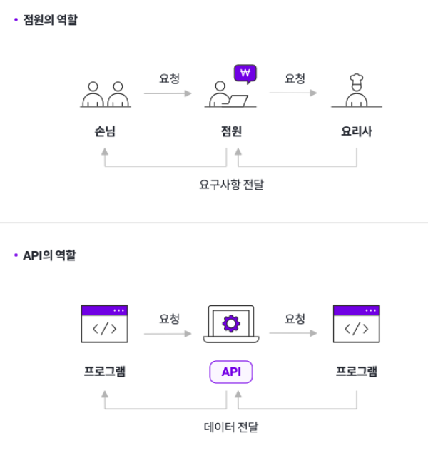
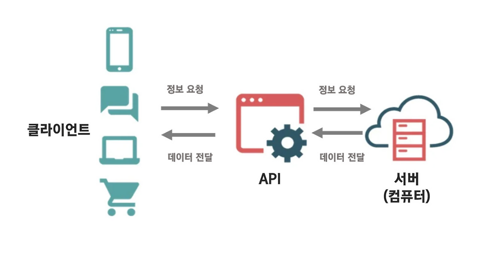
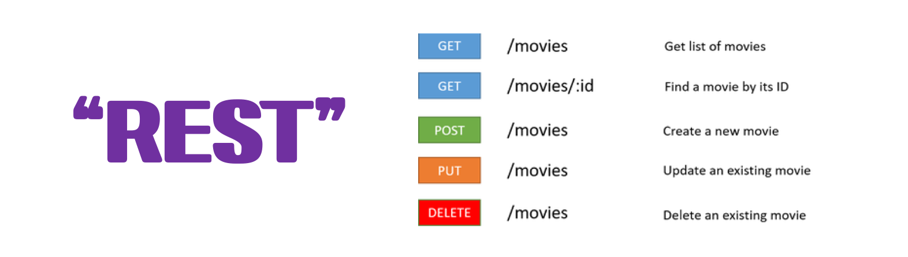
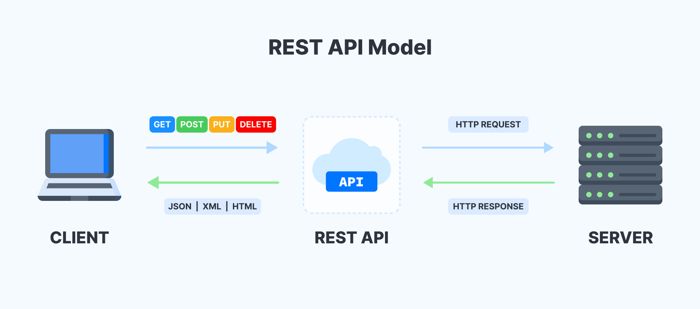
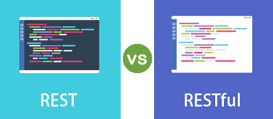

[교육 목표]

1. API의 의미를 이해한다.
2. REST의 개념을 이해한다.
3. REST API의 설계규칙을 이해한다.
4. REST API와 RESTful API의 차이를 알 수 있다.

---

# API란?

이미지 출처: [API가 무엇인가요?](https://brunch.co.kr/@dcf4c85da7c74e8/89)

이미지 출처: [[면접] API, REST, REST API, RESTful API 차이점은 무엇인가](https://cho9407.tistory.com/95)

> **API(Application Programming Interface)** 
두 소프트웨어 구성 요소가 정의 및 프로토콜 집합을 사용하여 서로 통신할 수 있게 하는 메커니즘
> 
- API의 맥락에서 애플리케이션이라는 단어는 고유한 기능을 가진 모든 소프트웨어를 나타냄
- 인터페이스는 두 애플리케이션 간의 서비스 계약. 이 계약은 요청과 응답을 사용하여 두 애플리케이션이 서로 통신하는 방법을 정의함. API 문서에는 개발자가 이러한 요청과 응답을 구성하는 방법에 대한 정보가 들어 있음.
- API는 백엔드에서 프론트엔드와 통신하기 위한 일반적인 메커니즘.

<aside>

- 식당에서의 예시
    
    ---
    
    점원이 메뉴판을 가져다줄 것이고 여러분은 메뉴판에서 음식을 선택 후 점원에게 요청을 할 것입니다. 점원은 주문받은 요리를  요리사에게 요청할 것이고, 요리사는 열심히 요리를 해서 점원에게 요리를 전달할 것입니다. 그리고 그 요리를 점원이 여러분에게 가졌다고 주고, 여러분은 맛있는 식사를 할 것입니다.
    
    여기서 나온 사람들 중 점원을 API라고 생각하시면 이해가 편하게 됩니다.
    
    API는 손님(프로그램)이 주문할 수 있게 메뉴(명령 목록)를 정리하고, 주문(명령)을 받아 요리사(응용프로그램)와 상호작용 후 요청된 메뉴(명령에 대한 값)를 전달합니다.
    
    결과론적으로 API는 프로그램들이 서로 상호작용 하는 것을 도와주는 매개체로 볼 수 있습니다.
    
</aside>

## API 종류

API가 생성된 시기와 이유에 따라 API는 네 가지 방식으로 작동

| API 유형 | 설명 | 특징 |
| --- | --- | --- |
| SOAP | 단순 객체 접근 프로토콜 |   • XML 기반 메시지 교환   • 과거에 많이 사용, 유연성 낮음 |
| RPC | 원격 프로시저 호출 |   • 클라이언트가 서버의 함수/프로시저 호출, 결과 반환 |
| Websocket | TCP 기반 양방향 통신 프로토콜 |   • JSON 객체 사용 데이터 전달   • 서버가 클라이언트에 콜백 전송 가능, REST보다 효율적 |
| REST | REST 아키텍처의 제약 조건을 준수하는 웹 API |   • 클라이언트가 요청 데이터 전송, 서버가 내부 함수 실행 후 결과 반환  • 가장 많이 사용되고 유연한 API |

# REST란?

## REST의 유래

**REST**는 REpresentational State Transfer의 약자로 2000년도 로이 필딩 (Roy Fielding)의 박사학위 논문에서 최초로 소개됨.

로이 필딩은 HTTP의 주요 저자중 한 사람으로서 웹(HTTP) 설계의 우수성에 비해 제대로 사용되지 못하는 모습에 안타까워하며 **웹의 장점을 최대한 활용할 수 있는 아키텍쳐로써 REST를 발표**

## REST의 정의

이미지 출처: [[Network] REST란? REST API란? RESTful이란?](https://gmlwjd9405.github.io/2018/09/21/rest-and-restful.html)

> **REST(Representational State Transfer)**  API가 **자원**을 **이름(자원의 표현)**으로 구분해 해당 자원의 **상태(정보)**를 주고받도록 조건을 부과하는 아키텍처 스타일 
> 네트워크 상에서 Client와 Server 사이의 통신 방식 중 하나
> 
- 자원 : 해당 소프트웨어가 관리하는 모든 것 ( 문서, 그림, 데이터, 해당 소프트웨어 자체 등 )
- 표현 : 그 자원을 표현하기 위한 이름 ( DB의 학생 정보가 자원이면, 'students'를 자원의 표현으로 정함 )
- 상태 전달 : 데이터가 요청되는 시점에 자원의 상태를 전달

**한줄 정리** ⇒ 어떤 자원에 대해 CRUD(Create, Read, Update, Delete) 연산을 수행하기 위해 URI(Resource)로 GET, POST 등의 방식(Method)을 사용하여 요청을 보내며, 요청을 위한 자원은 특정한 형태(Representation of Resource)로 표현된다.

## **REST의 구성요소**

1. **자원(Resource) - URI** 
    - 모든 자원에는 고유한 ID가 존재하고, 이 자원은 서버에 존재
    - 자원을 구별하는 ID : '/exgroups/:exgroup_id'와 같은 HTTP URI
    - Client는 URI를 이용해 자원을 지정하고 해당 자원의 상태(정보)에 대한 조작을 Server에 요청함
        - URI: Uniform Resource Identifier로 인터넷 상의 자원을 식별하기 위한 문자열의 구성
2. **행위(Verb) - Method**
    - 표준 HTTP 메소드를 사용
    - HTTP 프로토콜은 GET, POST, PUT, PATCH, DELETE의 Method를 제공함. ( CRUD )
    
    | **메서드** | **설명** |
    | --- | --- |
    | GET | Read : 정보 요청, URI가 가진 정보를 검색하기 위해 서버에 요청한다. |
    | POST | Create : 정보 입력, 클라이언트에서 서버로 전달하려는 정보를 보낸다. |
    | PUT | Update : 정보 업데이트, 주로 내용을 갱신하기 위해 사용한다. (데이터 전체를 바꿀 때) |
    | PATCH | Update : 정보 업데이트, 주로 내용을 갱신하기 위해 사용한다. (데이터 일부만 바꿀 때) |
    | DELETE | Delete : 정보 삭제. (안전성 문제로 대부분 서버에서 비활성화한다.) |
3. **표현(Representation of Resource)**
    - 클라이언트와 서버가 데이터를 주고받는 형태(JSON, XML, TEXT, RSS 등)
    - JSON, XML을 통해 데이터를 주고 받는 것이 일반적

## REST의 원칙

1. **균일한 인터페이스(Uniform Interface)**
    
    클라이언트와 서버 간의 통신을 단순화하고 표준화하기 위한 것이 목표
    
2. **무상태성(Stateless)**
    
    각 요청 간에 클라이언트의 상태 정보가 서버에 저장되지 않아야함
    
    세션 정보나 쿠키정보를 별도로 저장하고 관리하지 않기 때문에 API 서버는 들어오는 요청만을 단순히 처리하면 됨
    
    때문에 서비스의 자유도가 높아지고 서버에서 불필요한 정보를 관리하지 않음으로써 구현이 단순해짐
    
3. **서버-클라이언트 구조(Client-Server Architecture)**
    
    REST 서버는 API 제공, 클라이언트는 사용자 인증이나 컨텍스트(세션, 로그인 정보)등을 직접 관리하는 구조로 각각의 역할이 확실히 구분되기 때문에 클라이언트와 서버에서 개발해야 할 내용이 명확해지고 서로간 의존성이 줄어듦
    
4. **캐시가능성(Cacheable)**
    
    클라이언트는 응답을 캐싱할 수 있어야 하며, 이는 네트워크 효율성을 향상시킴
    
    예) 이미지가 많은 웹 사이트를 방문할 때 서버는 동일한 이미지를 다시 전송하지않고 클라이언트가 해당 이미지를 캐싱해서 캐시에서 직접 이미지를 사용합니다.
    
    - 캐싱: 자주 사용하는 데이터나 값을 임시 저장소(캐시)에 복사해 두어, 다음에 동일한 요청이 있을 때 더 빠르고 효율적으로 데이터를 제공하는 기술
5. **온디맨드 코드(On-demand code)(옵션)**
    
    서버는 소프트웨어 프로그래밍 코드를 클라이언트에 전송하여 클라이언트 기능을 일시적으로 확장하거나 사용자 지정할 수 있음
    
    즉 클라이언트가 서버로부터 스크립트(코드)를 받으면 이를 실행시킬 수 있어야함을 의미
    
    예) 서버에서 코드 전송 → 클라이언트: 웹 사이트에서 잘못된 전화번호를 입력하면 즉시 알려줌
    
6. **계층 구조 (Layered System)**
    
    클라이언트는 자신이 직접 연결된 서버 또는 중간 레이어에 있는 서버와 통신하는지 알 수 없음
    
    이러한 계층화는 시스템의 확장성을 향상시킴
    

## REST가 필요한 이유

- 애플리케이션 분리 및 통합
- 다양한 클라이언트의 등장

최근의 서버 프로그램은 다양한 브라우저와 안드로이폰, 아이폰과 같은 모바일 디바이스에서도 통신을 할 수 있어야 한다.이러한 멀티 플랫폼에 대한 지원을 위해 서비스 자원에 대한 아키텍처를 세우고 이용하는 방법을 모색한 결과, REST에 관심을 가지게 되었다.

# **REST API, RESTful API란 무엇인가?**

> REST API는 REST를 기반으로 만들어진 API를 의미함
그 중 REST를 잘 따른 API를 RESTful API라고 부름
> 

# REST API

> REST API는 REST를 기반으로 만들어진 API를 의미함
> 

이미지 출처: [REST API란 무엇이며 다른 유형과 어떻게 다른가요?](https://appmaster.io/ko/blog/rest-apiran-mueosimyeo-dareun-yuhyeonggwa-eoddeohge-dareungayo)

<aside>

- 음식 주문의 예시
    
    ---
    
    손님은 메뉴판을 보고 원하는 음식을 점원에게 주문합니다. 점원은 이 주문을 받아 주방(요리사)에 전달하고, 주방은 요청을 처리한 뒤 결과(음식이나 품절 여부 등)를 다시 점원에게 전달합니다. 그리고 점원은 그 결과를 손님에게 전달하게 됩니다.
    
    여기서 점원은 **API**, 손님은 **클라이언트(프로그램)**, 주방은 **서버**라고 볼 수 있습니다.
    
    즉, API는 클라이언트의 요청을 받아 서버에 전달하고, 서버의 응답을 다시 클라이언트에게 전달하는 **중간 매개체** 역할을 합니다.
    
    이 과정에서 요청은 메뉴 주문처럼, 응답은 음식이나 영수증처럼 데이터(JSON 등) 형태로 전달됩니다.
    
    결론적으로 API는 **프로그램 간 상호작용을 가능하게 해주는 인터페이스**라고 이해하면 됩니다.
    
</aside>

## REST API 설계 기본 규칙

REST API 설계 시 가장 중요한 항목

1. URI는 정보의 자원을 표현해야 한다.
2. 자원에 대한 행위는 HTTP Method(GET, POST, PUT, PATCH, DELETE)로 표현한다.
    1. 행위(Method)는 URI에 포함하지 않는다.

## REST API 설계 규칙

1. URI는 명사를 사용한다.(리소스명은 동사가 아닌 명사를 사용해야 한다.)
2. 슬래시( / )로 계층 관계를 표현한다.
3. URI 마지막 문자로 슬래시 ( / )를 포함하지 않는다.
4. 밑줄( _ )을 사용하지 않고, 하이픈( - )을 사용한다.
5. URI는 소문자로만 구성한다.
6. HTTP 응답 상태 코드 사용
    - 클라이언트는 해당 요청에 대한 실패, 처리완료 또는 잘못된 요청 등에 대한 피드백을 받아야 한다.
    
    | 코드 | 이름 | 의미 |
    | --- | --- | --- |
    | 200 | OK | 요청 성공 |
    | 201 | Created | 생성 성공 |
    | 400 | Bad Request | 요청 형식 잘못됨 |
    | 404 | Not Found | 없는 자원 요청 |
    | 500 | Internal Server Error | 서버 내부 오류 |
7. 파일확장자는 URI에 포함하지 않는다.
8. 조회 시 쿼리를 활용한다.

# REST API vs RESTful API

이미지 출처: [[API/서버/백엔드] REST API vs RESTful API 비슷해보이는데 뭐가 달라??](https://m.blog.naver.com/codingbarbie/223233477242)

RESTful은 REST의 설계 규칙을 잘 지켜서 설계된 API를 RESTful한 API라고 함
즉, REST의 원리를 잘 따르는 시스템을 RESTful이란 용어로 지칭됨

RESTful하게 만든 API는 요청을 보내는 주소만으로도 어떤 것을 요청 하는지 파악이 가능함

---

### 출처

<aside>

https://www.oracle.com/kr/cloud/cloud-native/api-management/what-is-api/

https://aws.amazon.com/ko/what-is/api/

https://wikidocs.net/341075

https://developer.mozilla.org/ko/docs/Glossary/REST

https://www.ibm.com/kr-ko/think/topics/rest-apis

https://aws.amazon.com/ko/what-is/restful-api/

</aside>