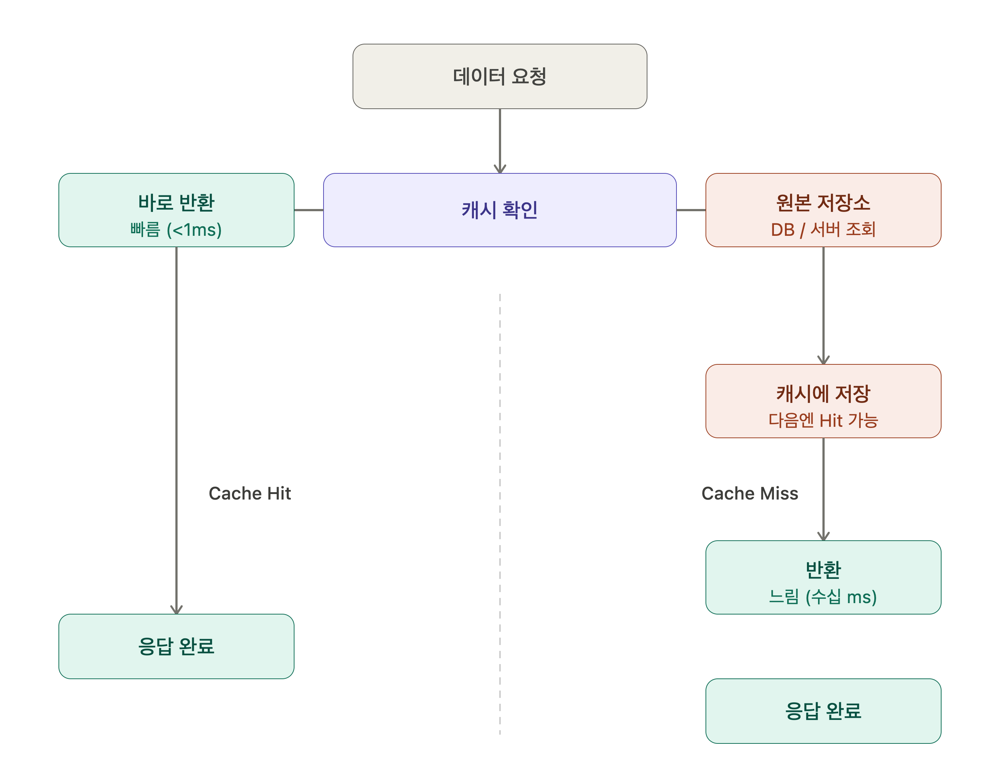
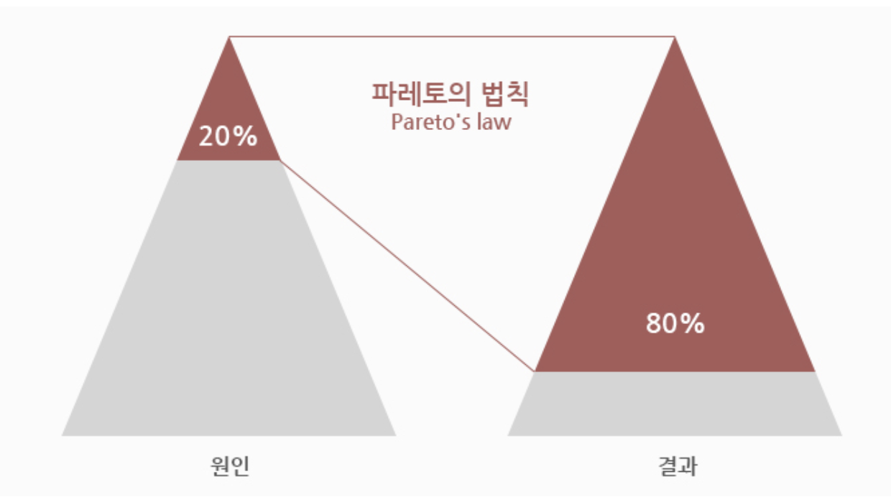
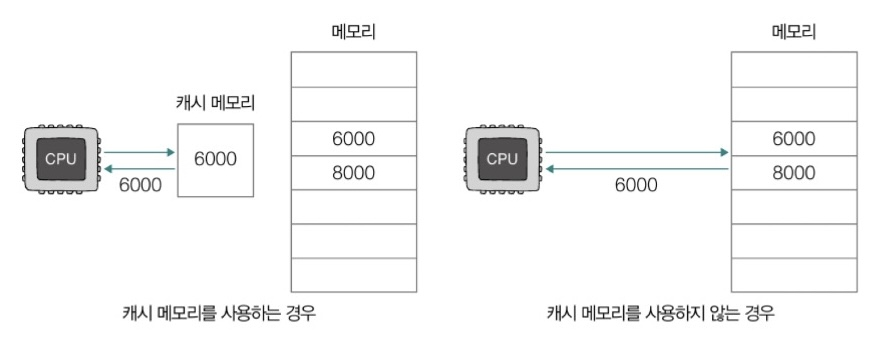
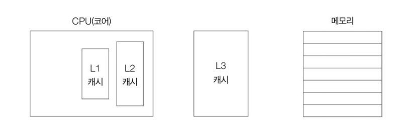
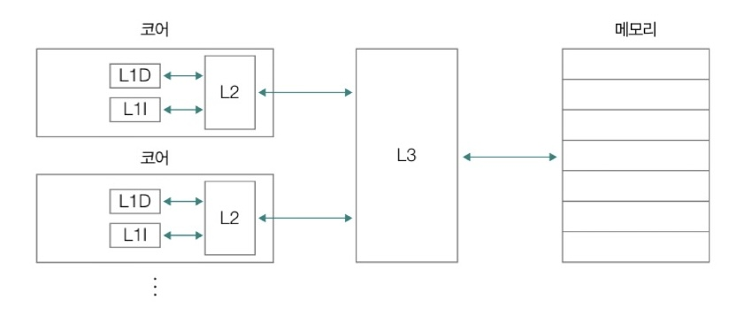
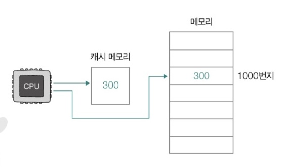
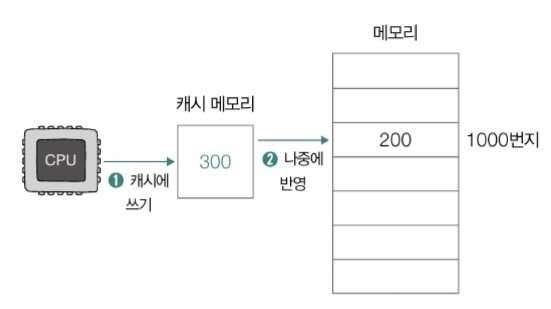
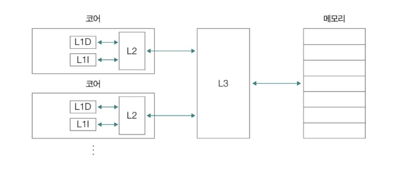

참고 자료

https://www.youtube.com/watch?v=eC5uLXb9Aww&t=24s

https://www.youtube.com/watch?v=c33ojJ7kE7M

https://aws.amazon.com/ko/caching/

https://www.cloudflare.com/learning/cdn/what-is-caching/

https://chelseashin.tistory.com/43

https://velog.io/@kangdev/%EC%9A%B4%EC%98%81%EC%B2%B4%EC%A0%9C-%EC%BA%90%EC%8B%9C%EC%9D%98-%EC%A7%80%EC%97%AD%EC%84%B1-locality-of-cache

https://parade621.tistory.com/28

https://redis.io/glossary/lru-cache/

https://www.alachisoft.com/ko/foundations/caching-strategies/cache-invalidation/

https://www.howtogeek.com/891526/l1-vs-l2-vs-l3-cache/

https://docs.tosspayments.com/resources/glossary/cdn

---

### 캐시란 무엇인가?

캐시는 **자주 사용되는 데이터의 일부를 빠르게 꺼낼 수 있도록 임시로 저장하는 고속 데이터 스토리지 계층이**다. 원래 데이터가 있는 저장소(예: 데이터베이스, 디스크)보다 훨씬 빠르게 응답할 수 있어서, 이전에 한 번 처리한 결과를 다시 계산하거나 불러오는 수고를 줄여준다.

**→ 자주 사용하는 데이터나 값을 미리 복사해 놓는 임시 저장소. "캐시"라는 용어는 소프트웨어 또는 하드웨어의 효율성을 높이기 위해 사용되는 여러 유형의 임시 메모리 저장소를 지칭할 수 있다.**

### 캐시는 어떻게 작동하는가?

- 데이터를 RAM(Random Access Memory) 같은 빠른 하드웨어에 저장한다.
    - 캐시의 두 가지 맥락
        
        **① 하드웨어 레벨 캐시 (CPU 캐시)**
        
        - CPU 내부 또는 아주 가까이에 있는 초고속 메모리
        - L1 / L2 / L3 캐시로 나뉘며, RAM보다도 훨씬 빠르다.
        - CPU가 RAM에 매번 접근하면 느리기 때문에, 자주 쓰는 데이터를 CPU 옆에 붙여놓은 것.
        - 속도 순서: CPU 캐시 > RAM > SSD/HDD
        
        **② 소프트웨어/서비스 레벨 캐시**
        
        - 데이터베이스(디스크)보다 빠른 RAM을 캐시 저장소로 활용하는 개념
        - Redis, Memcached 같은 인 메모리 DB가 대표적인 예시
        - 여기서 RAM은 DB(디스크)에 비해 상대적으로 빠른 계층으로 사용되는 것.
        
        | 구분 | CPU 캐시 | 소프트웨어 캐시 |
        | --- | --- | --- |
        | 위치 | CPU 내부 (L1/L2/L3) | RAM (인 메모리) |
        | 목적 | CPU ↔ RAM 속도 차 보완 | 앱/서버 ↔ DB 속도 차 보완 |
        | 관리 주체 | 하드웨어 자동 관리 | 개발자/시스템이 직접 설계 |
        | 예시 | Intel/AMD CPU 내 캐시 | Redis, Memcached, CDN |
    
    결국 **"느린 저장소와 빠른 처리 사이의 병목을 줄이는 임시 저장소"** 라는 캐시의 핵심 개념은 동일하고, 어느 계층에서 보느냐에 따라 CPU 캐시도 맞고 RAM 기반 캐시도 맞는 말이다.
    
- 느린 기본 스토리지(DB, 디스크)에 접근하는 횟수를 줄이는 것이 핵심 목적
- 캐시는 속도를 위해 용량을 절충하는 구조로, 전체 데이터가 아닌 일부 데이터만 임시로 보관한다.
- 데이터베이스가 영구적이고 완전한 데이터를 저장하는 것과 대조된다.
- 기본 동작 구조
    
    
    
    1. 클라이언트로부터 데이터 요청을 받는다.
    2. 캐시를 확인한다.
    3. 캐시에 요청 데이터가 있다면 바로 반환한다. = `캐시 히트`
    4. 캐시에 요청 데이터가 없다면 (즉, 첫 요청이거나 만료/삭제된 경우 → `캐시 미스`) 원본 저장소에서 데이터를 가져오고, 다음 요청에는 캐시 히트가 되도록 캐시에 저장한 뒤 반환한다.

### 캐시의 계층 구조 (어디에 적용되나?)

캐시는 시스템의 여러 단계에 걸쳐 적용된다.

| 계층 | 사용 사례 | 주요 기술 |
| --- | --- | --- |
| **클라이언트 측** | 웹 콘텐츠 빠르게 불러오기 (브라우저/기기) | HTTP 캐시 헤더, 브라우저 캐시 |
| **DNS** | 도메인 ↔ IP 주소 변환 캐싱 | DNS 서버 |
| **웹 서버** | 서버에서 웹 콘텐츠 전송 속도 향상, 세션 관리 | CDN, 역방향 프록시, 키-값 스토어 |
| **앱 서버** | 애플리케이션 성능 및 데이터 접근 가속화 | 키-값 데이터 스토어, 로컬 캐시 |
| **데이터베이스** | DB 쿼리 지연 시간 단축 | DB 버퍼, 키-값 데이터 스토어 |

### 캐시의 주요 이점

- **애플리케이션 성능 향상**: 응답 속도가 빨라진다.
- **데이터베이스 비용 절감**: DB 쿼리 요청 수가 줄어들어 인프라 비용이 낮아진다.
- **예측 가능한 성능**: 트래픽이 몰려도 안정적인 응답 속도를 유지한다.
- **데이터베이스 핫스팟 제거**: 특정 데이터에 요청이 집중되는 현상을 방지한다.
- **읽기 처리량(IOPS) 증가**: 더 많은 요청을 동시에 처리할 수 있다.

### 캐시가 쓰이는 대표 사용 사례

- **CDN(콘텐츠 전송 네트워크)**: 이미지, 동영상 등 정적 자원을 사용자 근처 서버에서 빠르게 제공
- **DNS 캐싱**: 도메인 조회 결과를 저장해 반복 조회 속도 향상
- **세션 관리**: 로그인 상태 등 사용자 세션 데이터를 빠르게 읽고 씀
- **API 캐싱**: 반복 호출되는 API 응답 결과를 캐싱해 서버 부하 감소
- **웹 캐싱**: HTML, CSS 등 웹 페이지 자원 저장
- **모바일/IoT/게임/이커머스** 등 다양한 산업 분야에서 활용

### 캐시의 효율성을 높이기 위해

#### 파레토의 법칙과 지역성의 원리

- 개발하는 데에 있어서 “캐시로 처리한다” = 나중에 요청할 결과를 미리 저장해둔 후 요청이 오면 빠르게 처리한다는 걸 의미.
    - 즉, 미리 결과를 저장하고, 나중에 요청이 오면 그 요청에 대해서 DB 또는 API를 참조하지 않고 캐시를 참조하여 요청을 처리하도록 만들겠다는 것
    - 캐시는 자주 사용하는 데이터나 값을 미리 복사해 놓은 임시 장소이기 때문.
- 이러한 동작 배경에는 파레토 법칙과 지역성 원리가 있음
- 파레토 법칙이란
    
    
    
    - 80%의 결과는 20%의 원인으로 인해 발생한다
        - ex. 어떤 가게의 80% 매출이 20%의 단골들에게서 나온다
        - ex. 많이 쓰이는 단어 20%가 언어 사용빈도의 80%를 차지한다
- 그럼 이 20%의 핵심 데이터는 어떻게 선별하는가?
    
    → 지역성 원리를 이용
    

#### **캐시(Cache)의 지역성(Locality)**

- 캐시가 효율적으로 동작하려면, 캐시의 적중율(Hit-rate)를 극대화 시켜야 한다.
- 캐시에 저장할 데이터가 **지역성(Locality)**을 가져야 한다.
- 지역성이란, **데이터 접근이 시간적, 혹은 공간적으로 가깝게 일어나는 것**을 의미한다.
- 지역성의 전제 조건으로 프로그램은 모든 코드나 데이터를 균등하게 Access하지 않는다는 특성을 기본으로 한다.
- 즉, **지역성(Locality)**이란
    - 기억장치 내의 정보를 균일하게 Access하는 것이 아닌 **어느 한 순간에 특정 부분을 집중적으로 참조하는 특성**이다.

#### **지역성(Locality)의 종류**

| 종류 | 설명 | 예시 |
| --- | --- | --- |
| **시간 지역성** | 최근에 쓴 데이터는 곧 또 쓸 가능성이 높다 | for문의 조건 변수 i |
| **공간 지역성** | 방금 쓴 데이터 근처의 데이터도 곧 쓸 가능성이 높다 | array[0] 접근 후 array[1], array[2]… |

⇒ 이 두 가지 성질 덕분에 '자주 쓰는 데이터를 미리 빠른 곳에 가져다 놓는다'는 캐시 전략이 실제로 효과를 발휘할 수 있다.

### 캐시 메모리

- **캐시 메모리**란?
    - **CPU와의 연산 속도와 메모리 접근 속도의 차이를 줄이기 위한 탄생한 저장장치**
        - CPU는 프로그램 실행 과정에서 빈번히 메모리에 접근해야 하는데, CPU의 연산 속도가 아무리 빨라도 메모리 접근 속도가 느리면 효용이 없기 때문이다.
    - CPU와 메모리 사이에 위치한 SRAM 기반의 저장장치
    - **메모리에서 CPU가 사용할 일부 데이터를 미리 가져와 저장**하고 활용한다.
    
    
    

- 캐시 메모리의 종류
    - L1캐시, L2캐시, L3캐시
        - 코어와 가장 가까운 캐시 메모리가 L1, 그 다음으로는 L2, 그 다음으로는 L3
        
        
        
    - 메모리의 크기: L3 > L2 > L1
    - 속도: L1 > L2 > L3
    - CPU가 메모리 내에 데이터가 필요하다고 판단 시 → L1 캐시 메모리 먼저 검색하고, 없다면 L2, L3 순으로 검색

- 멀티코어 프로세서(명령어를 읽어 들이고, 해석하고, 실행하는 부품인 코어가 여러 개 존재)의 경우?
    - L1 캐시 메모리와 L2 캐시 메모리는 코어마다 고유함
    - L3 캐시는 여러 코어가 공유하는 형태
        
        
        

- **분리형 캐시**
    - 코어와 가장 가까운 **L1 캐시 메모리 ⇒ 두 가지 유형으로 구분된다**
        - 명령어만을 저장하는 **L1I** 캐시
        - 데이터만을 저장하는 **L1D** 캐시
    
    
    

### 캐시 히트와 캐시 미스

캐시 메모리는 메모리의 일부를 복사하여 저장하는데, **CPU가 사용할 법한 것**을 저장한다.

| 용어 | 의미 | 결과 |
| --- | --- | --- |
| **Cache Hit** | 요청한 데이터가 캐시에 있음 | 빠르게 반환 ✅ |
| **Cache Miss** | 요청한 데이터가 캐시에 없음 | 원본 저장소에서 조회 후 캐시에 저장 ❌→ 다음엔 Hit |

- **캐시 히트**
    - 캐시 메모리가 예측하여 저장한 데이터가 CPU에 의해 실제로 사용되는 경우

- **캐시 미스**
    - 틀린 예측으로 인해 CPU가 메모리로부터 필요한 데이터를 직접 가져와야 하는 경우
    - 캐시 히트에 비해 CPU의 성능이 떨어짐

- **캐시 적중률**
    - 캐시가 히트되는 비율
    
    ```
    캐시 히트 횟수 / (캐시 히트 횟수 + 캐시 미스 횟수)
    ```
    

### 참조 지역성의 원리

CPU가 사용할 법한 데이터는 어떻게 예측하는 걸까?

→ 캐시 메모리는 **참조 지역성의 원리**에 따라 메모리로부터 가져올 데이터를 결정한다.

> 참조 지역성의 원리:
**시간 지역성, 공간 지역성**
> 

- **시간 지역성**
    - 최근에 접근했던 메모리 공간에 다시 접근하려는 경향
    - 대표적 예시: 변수
        - 일반적으로 변수에 저장된 값은 한 번만 사용되지 않고, 프로그램이 실행되는 동안 여러 번 사용된다.

- **공간 지역성**
    - 접근한 메모리 공간의 근처에 접근하려는 경향
    - 대표적 예시: 배열
        - 예시로, 2차원 배열은 메모리 내에 일렬로 저장될 때 행과 열의 순으로 저장된다. 
        따라서 이중 반복문을 통해 배열의 요소들에 접근할 때 **순차적 접근**(한 열의 모든 행 순회하고, 그 다음 열의 모든 행을 순회) 방식이 공간 지역성 측면에서 실행 속도를 크게 줄여준다.

### 캐시 메모리의 쓰기 정책과 일관성

CPU가 캐시 메모리에 데이터를 쓸 때는 캐시 메모리에 **새롭게 쓰여진 데이터와 메모리상의 데이터가 일관성**을 유지해야 한다.

예를 들어, 현재 메모리 1000번지에 200이라는 값이 저장되어 있고, 이 값이 캐시 메모리에도 저장되어 있다. 만약 CPU가 이 값을 200에서 300으로 바꾸고 싶다고 할 때, 곧장 메모리 1000번지의 값을 바꾸어도 CPU는 1000번지 값을 얻기 위해 캐시 메모리를 참조하고 있기 때문에 여전히 200을 출력한다.

이를 방지하는 2가지 방법

1. **즉시 쓰기**
    - 캐시 메모리와 메모리에 동시에 쓰는 방법
    - 메모리를 항상 최신 상태로 유지하며 캐시 메모리와 메모리 간의 일관성이 깨지는 상황 방지
    - 데이터를 쓸 때마다 메모리를 참조해야 하므로 버스의 사용 시간과 쓰기 시간 늘어난다는 단점
    
    
    

2. **지연 쓰기**
    - 캐시 메모리에만 값을 써두었다가 추후 수정된 데이터를 한 번에 메모리에 반영
    - 메모리 접근 횟수를 줄일 수 있어 속도는 더 빠르지만, 메모리와 캐시 메모리 간의 일관성이 깨질 수 있다는 위험
    
    
    
    - 다른 코어가 사용하는 캐시 메모리와의 불일치 발생 위험
    
    

**결론**

캐싱을 한다는 것은 데이터 접근에 있어 어느 정도 빠른 성능은 보장할 수 있지만, 그와 동시에 데이터의 일관성을 유지하기 위한 책임이 따른다.