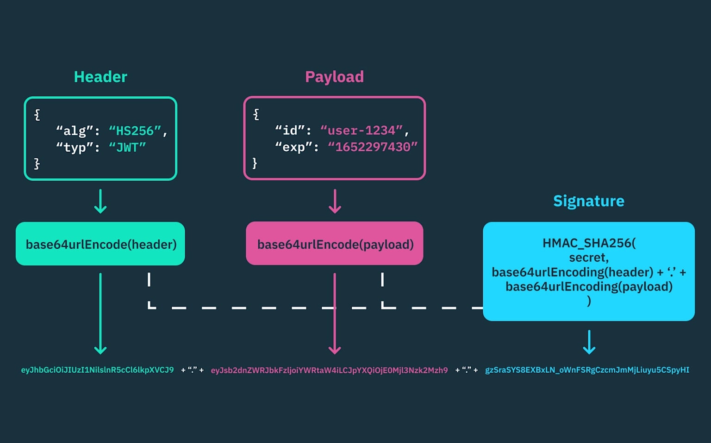

## 1. 소셜 로그인이 필요한 이유

- 기존 회원가입은 **캡차, 비밀번호 규칙, 문자 인증, PASS 인증** 같은 절차가 많아서 사용자 이탈이 쉽게 발생
- 실제 서비스에서는 ‘가입이 어렵다’는 이유만으로도 전환율이 크게 떨어짐

→ **소셜 로그인은 단순 편의 기능이 아니라, 가입 전환율을 높이기 위한 핵심 설계**

## 2. 소셜 로그인 개념

- 카카오, 구글, 네이버 같은 외부 플랫폼의 계정을 이용해 다른 서비스에 로그인 하는 방식
- 사용자의 비밀번호를 우리 서비스가 직접 받지 않고, 인증은 외부 플랫폼이 대신 수행
- 우리 서비스는 그 결과로 전달된 사용자 정보만 받아 회원가입과 로그인을 처리

**→ 소셜 로그인은 “우리 서비스가 직접 인증하는 것”이 아니라, 외부 인증 결과를 신뢰해서 내부 사용자로 연결하는 구조**

## 3. 왜 외부 플랫폼에 맡기는가

**자체 회원가입**:

- 비밀번호 암호화 직접 구현
- 해킹 시 전체 유저 데이터 위험
- 보안 유지 비용 큼

**소셜 로그인**:

- 검증된 보안 인프라 사용
- 24시간 보안 관리
- 개발 비용 절감

→ **보안은 직접 구현하는 게 아니라, 잘하는 곳에 맡기는 것**

## 4. OAuth 2.0의 역할

- 외부 기관에 인증을 위임하는 프로토콜
- 중요한 점은 OAuth 2.0이 비밀번호를 넘겨받는 방식이 아니라, 특정 정보에 대한 접근 권한만 위임하는 구조
- 이 표준 덕분에 여러 플랫폼이 동일한 방식으로 인증 흐름을 제공

→ **실무에서는 OAuth 2.0으로 끝난다고 보기보다, OpenID Connect와 함께 사용하는 경우가 더 많음**

## **5. OAuth 2.0 동작 흐름**

소셜 로그인은 보통 다음 순서로 진행

1. 사용자가 로그인 버튼을 누른다.
2. 서비스가 외부 인증 서버로 이동시킨다.
3. 사용자가 외부 플랫폼에서 로그인한다.
4. 외부 플랫폼이 동의 화면을 보여준다.
5. 사용자가 동의하면 인증 코드를 발급한다.
6. 서비스 서버가 그 코드를 이용해 토큰을 요청한다.
7. 서버는 토큰을 받아 사용자 정보를 조회한다.
8. 우리 서비스는 해당 사용자를 회원으로 처리한다.

**→ 이 흐름에서 중요한 것은, 비밀번호는 외부 플랫폼에만 입력되고 우리 서비스는 보지 못한다는 점. 우리 서버는 최종적으로 검증된 코드와 토큰만 처리**

## 6. 로그인 유지 방식

**세션 방식**

- 서버가 사용자 상태를 기억하는 방식
- 구현은 비교적 직관적
- 사용자 수가 많아질수록 서버 메모리나 DB 부담 늘어남

**토큰 방식**

- 서버가 상태를 저장하지 않는 Stateless구조
- 사용자가 토큰을 들고 다니며 요청할 때마다 서버가 그 유혀성만 검증
- 서버 확장성과 분산 환경에 유리해서 현대 웹 서비스에서 자주 사용

## 7. 세션과 토큰 비교

| 구분 | 세션(Stateful) | 토큰(Stateless) |
| --- | --- | --- |
| 서버 상태 저장 | 필요함 | 필요 없음 |
| 확장성 | 상대적으로 불리함 | 유리함 |
| 구현 난이도 | 비교적 단순 | 설계가 더 중요함 |
| 대표 사용처 | 전통적 웹 서비스 | API 서버, SPA, MSA |

**→ 세션은 서버가 기억하고, 토큰은 사용자가 증명**

## 8. JWT란 무엇인가

- JWT = JSON Web Token
- 로그인에 성공한 사용자에게 발급되는 토큰
- 사용자는 이후 요청에서 이 토큰을 제시하고, 서버는 토큰의 서명을 검증해 사용자 신원을 확인
- 서버가 상태를 저장하지 않아도 되기 때문에 확장성이 좋음

**→ JWT는 “내용이 담긴 증명서”처럼 동작. 다만 JWT 안의 정보는 인코딩되어 있을 뿐 암호화된 것이 아니므로, 민감한 정보는 넣으면 안됨**

## 9. JWT 구조

JWT는 일반적으로 `Header.Payload.Signature` 형태로 구성

점(`.` ) 두 개로 세 부분이 나뉘며, 각 부분은 다음 의미를 가짐

- **Header** : 토큰 타입과 서명 알고리즘 정보
- **Payload :** 사용자 ID, 권한, 만료 시간 같은 클레임 정보
- **Signature :** 위변조 방지를 위한 서명

**→ Payload는 누구나 디코딩할 수 있으므로, 비밀번호나 주민번호 같은 민감한 정보는 절대 넣으면 안됨**

**→ 서버는 Signature를 검증해서 토큰이 변조되지 않았는지 확인**

## 10. OAuth 2.0과 JWT의 관계

- OAuth2.0은 인증 절차를 정의하고, JWT는 그 이후 로그인 상태를 유지하는 데 자주 사용
- 이 줄은 자주 함께 사용되지만 같은 개념은 X

→ **OAuth2.0은 “누가 로그인할 수 있는가”를 다루고, JWT는 “로그인 이후 어떻게 유지할 것인가”를 다룸**

## 11. 소셜 로그인에서 생기는 예외 상황

소셜 로그인은 성공했는데, 실제 서비스 회원 생성에서 문제가 생기는 경우 발생

대표적인 예외는 필수 데이터 누락과 중복 계정 충돌

**필수 데이터 누락**

- 사용자 동의 거부 → 데이터 NULL
- 대응:
    - 필수값 검증
    - 추가 입력 UI 제공

**중복 계정 충돌**

- 동일 이메일로 다른 방식 가입

해결방법:

1. 이메일 중복 체크
2. 계정 연동 UI 제공
3. 하나의 유저 ID로 통합 관리

→ 로그인은 되는데 데이터가 깨지는 상황이 가장 위험

## 12. 데이터 정합성 처리

소셜 로그인 구현에서 가장 중요한 것은 “로그인 성공”이 아니라 **데이터 정합성 유지**

인증이 성공해도 우리 서비스 DB에 저장할 수 없는 상태라면, 전체 플로우는 실패한 것

이를 위해 다음이 필요

- 필수 정보 누락 검증
- 이메일 또는 고유 식별자 중복 체크
- 기존 계정과 소셜 계정의 매핑 구조
- 회원 생성과 연동을 분리한 설계

**→ 이 단계가 없으면 예외가 사용자에게 직접 노출되거나, DB에 중복 데이터가 쌓일 수 있음**

## 13. 예외 처리와 UX

예외를 처리하는 방식은 서비스 UX에 적접 영향을 줌

- **잘못된 방식**: “서버 오류 발생” → 사용자는 상황을 이해하지 못하고 이탈 가능성 증가
- **올바른 방식**: 추가 입력 유도 → 사용자 경험 좋음

**→ 예외 처리는 단순한 안정성 문제가 아니라 유저 이탈을 줄이는 UX 설계이기도 함**

## 14. 토큰 저장 위치

발급받은 토큰은 어디에 저장하느냐도 중요

**LocalStorage**

- 자바스크립트로 접근 가능해서 구현은 편리
- XSS 공격에 취약

**Cookie (HttpOnly, Secure)**

- 자바스크립트로 접근 불가 → 상대적으로 안전
- 다만 쿠키를 사용할 때는 CSRF 방어와 SameSite, Secure 설정도 함께 고려

**→ 실무에서는 토큰을 무조건 한 곳에만 두기보다, 서비스 구조에 맞게 저장 전략을 선택**

## 15. 토큰 만료의 딜레마

보안성과 UX가 충돌하는 대표적인 사례

**토큰 유효기간 짧으면:**

- 해킹 위험 ↓
- 사용자가 자주 로그아웃되는 문제 발생

**토큰 유효기간 길면:**

- 편리함
- 탈취되었을 때 피해 심각

**→ 실무에서는 Access Token과 Refresh Token을 분리하는 방식을 많이 사용. 짧게 쓰는 토큰과 길게 쓰는 토큰을 나눠서 위험을 줄이면서도 로그인을 유지하는 구조**

## **16. 토큰 이중화 구조**

토큰 이중화는 보안과 UX의 균형을 맞추는 대표적인 방법

- **Access Token**: 수명이 짧음, 일반 API 요청에 사용
- **Refresh Token**: 수명이 김, Access Token 재발급에 사용

Access Token이 만료되면 사용자는 다시 로그인하는 대신, 서버가 Refresh Token을 검증해 새 Access Token을 발급

**[토큰 갱신 흐름]**
    
    사용자 요청
    ↓
    Access Token 만료
    ↓
    Refresh Token으로 재발급 요청
    ↓
    Refresh Token 검증
    ↓
    새 Access Token 발급
    ↓
    사용자 로그인 상태 유지

    
## 참고 자료

[Kakao Developers 문서](https://developers.kakao.com/docs/ko/kakaologin/common)

[개요 - LOGIN](https://developers.naver.com/docs/login/overview/overview.md)

[OAuth 2.0을 사용하여 Google API에 액세스하기  |  Authorization  |  Google for Developers](https://developers.google.com/identity/protocols/oauth2?hl=ko)

[JWT 보안 완전 정복 — 서명 검증, 키 회전, 흔한 취약점과 방어 | Chaos and Order](https://www.youngju.dev/blog/devops/2026-06-12-jwt-security-best-practices-jws-jwe)

[OAuth 2.0과 소셜 로그인 실전 구현 – 구글, 카카오, 네이버 연동부터 실무 보안까지 단계별 가이드 | Developer Arthur](https://choi-hye-min.github.io/post20250615-4/)

[Google 소셜 로그인 연동 - OAuth 2.0](https://velog.io/@suunn001/Google-%EC%86%8C%EC%85%9C-%EB%A1%9C%EA%B7%B8%EC%9D%B8-%EC%97%B0%EB%8F%99-OAuth-2.0)